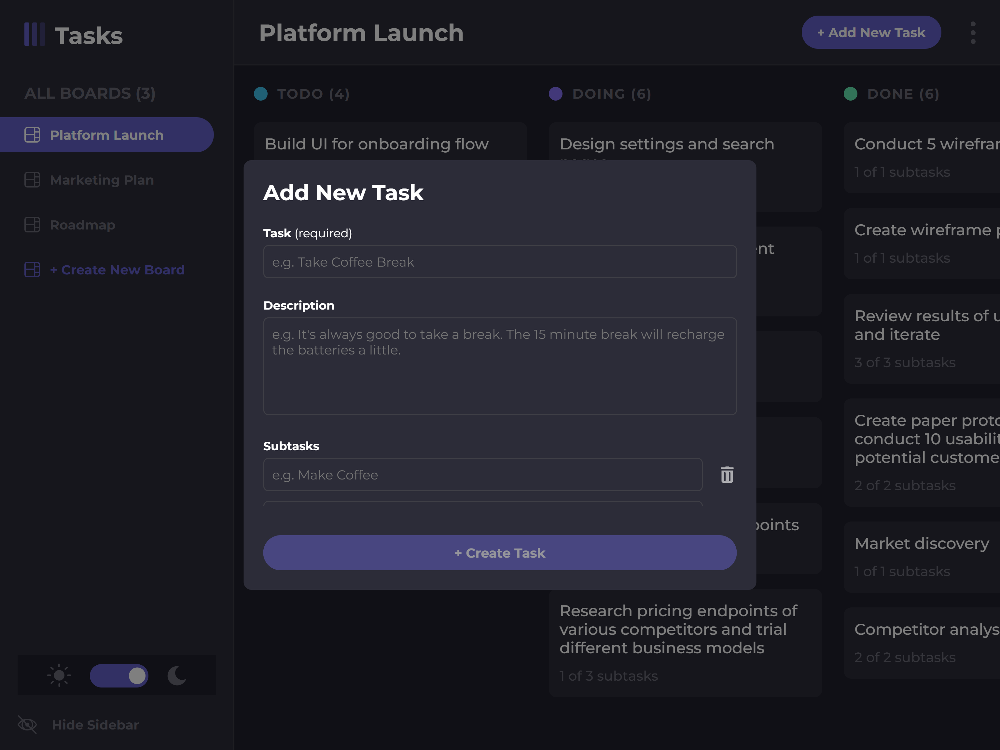

# Project Overview

## Table of contents

-  [Overview](#overview)
   -  [Features](#features)
   -  [UI Demo](#ui-demo)
   -  [Screenshots](#screenshots)
   -  [Links](#links)
-  [My process](#my-process)
   -  [Built with](#built-with)
   -  [What I learned](#what-i-learned)
   -  [Continued development](#continued-development)
   -  [Useful resources](#useful-resources)
-  [Author](#author)

## Overview

### Features

Users should be able to:

- Create, edit, and delete boards that represent groups of tasks
- Create, edit, and delete tasks
- Add subtasks to a task
- Edit and delete subtasks
- Group tasks by status (e.g. todo, doing, done)
- Have multiple boards and tasks
- Change theme from light to dark and vice versa

### UI Demo

### Screenshots

***Desktop Layout*** (1440 X 900)\

***Tablet Layout*** (768 X 1024)\

***Mobile Layout*** (414 X 896)

  
&nbsp; &nbsp; &nbsp; &nbsp;
  
  

### Links

- Repository URL: [Github Respository](https://github.com/jordan-na/task-manager.git)
- Live Site URL: [Hosted on Github Pages](https://jordan-na.github.io/task-manager/)

## My process

### Built with

- Semantic HTML5 markup
- CSS custom properties
- Flexbox
- Desktop-first workflow
- ReactJS
- CSS modules
- React components
- react-color library

### Components Overview

- **Main Components**:
   - ***App***: The main component that contains all other components
   - ***Sidebar***: The sidebar in the desktop layout
   - ***Logo***: The logo in the sidebar, also acts as a button to open the sidebar
   - ***BoardNav***: Contains the buttons to navigate between boards
   - ***BoardNavButton***: Button that allows user to change boards
   - ***NewBoardButton***: Button that allows user to create a board
   - ***NewBoard***: Form that allows user to create a new board
   - ***ThemeToggle***: Button that allows user to change the theme
   - ***Header***: Contains the board title, new task button, and kebab menu at the top of the screen
   - ***NewTask***: Form that allows user to create a task
   - ***MobileBoardNav***: Contains the buttons to navigate between boards on the mobile layout
   - ***MobileBoardButton***: Button that allows user to change boards on mobile
   - ***Board***: The board contains the task columns, tasks, and new column button
   - ***EditBoard***: Form that allows user to edit the board
   - ***BoardColumn***: Contains tasks that are of a certain status
   - ***Task***: Represents a task on the board
   - ***TaskDetails***: Shows the task details, including the task, subtasks, and status
   - ***SubtaskChecklist***: A checklist of the subtasks that belong to a task
   - ***Edit Task***: A form to edit a task
   - ***SubtaskInputs***: Has a list of inputs to add, edit, or delete subtasks
- **Provider Components**
   -  ***ThemeProvider***: Provides the theme context to the children components
   -  ***BoardProvider***: Provides the board context to the children components
      -  Allows access to board data
      -  Allows modification of board data
- **UI Components**
   -  ***Input***: Generic input component that can adapt to use conditions and provides custom TextArea, Select, and TextInput components
   -  ***KebabMenu***: Represents a kebab menu (3 vertial dots) that provides a UI for the user to interact with the app
   -  ***Modal***: An overlay that contains any UI that would go over the main UI

### What I learned

-  Non-technical skills:
   -  Brainstorming
      -  Asking what the user would want for a good UX
      -  Deciding on theme colors
      -  Deciding on font
      -  Visualizing animations
      -  Determing what assets are needed (e.g. images, svg)

-  Technical skills:
   -  Modeling project into react components
      -  Use appropriate parent child relationships that make sense
   -  Utilizing the storage API to store user data
   -  Formatting data into JSON-like objects to allow easy access and modification
   -  Using state to update UI
   -  Using the react context API to create project wide state
   -  Using custom components with providers to give access to context
   -  Using props to pass data from parent to child and vice versa
   -  React hooks
      -  Use state
         -  Set state for components for a dynamic UI
      -  Use context
         -  Access project wide state
      -  Use effect
         -  Execute code on initialization or after state change
      -  Use reducer
         -  Dispatch actions on related states to update them in a clear way
      -  Use ref
         -  Directly access component as variable to use dom properties
   -  Forwarding refs
   -  Using react portal to teleport elements to more suitable locations in the DOM
   -  Responsive UI/UX development
      -  Using the chrome inspector to emulate different screen sizes
   -  Using the chrome inspector to see the react components and debug

### Continued development

-  I will continue to learn react
-  The next step is to learn class based components as an alternative to funcional components

### Useful resources

-  [MDN](https://reactjs.org/) - This helped me by acting as a reference for the react library
-  [react-color](https://www.npmjs.com/package/react-color) - react libary for color picker components

## Author

-  Name: Jordan Na
-  Website - [Github Profile](https://github.com/jordan-na)
-  Frontend Mentor - [@jordan-na](https://www.frontendmentor.io/profile/jordan-na)
-  Email - jordster02@gmail.com
